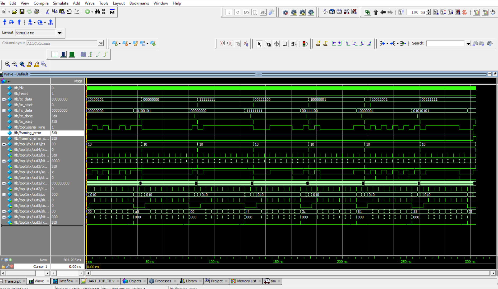
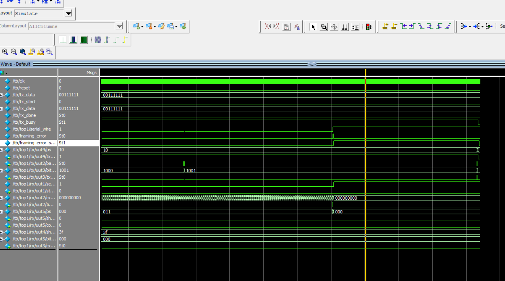
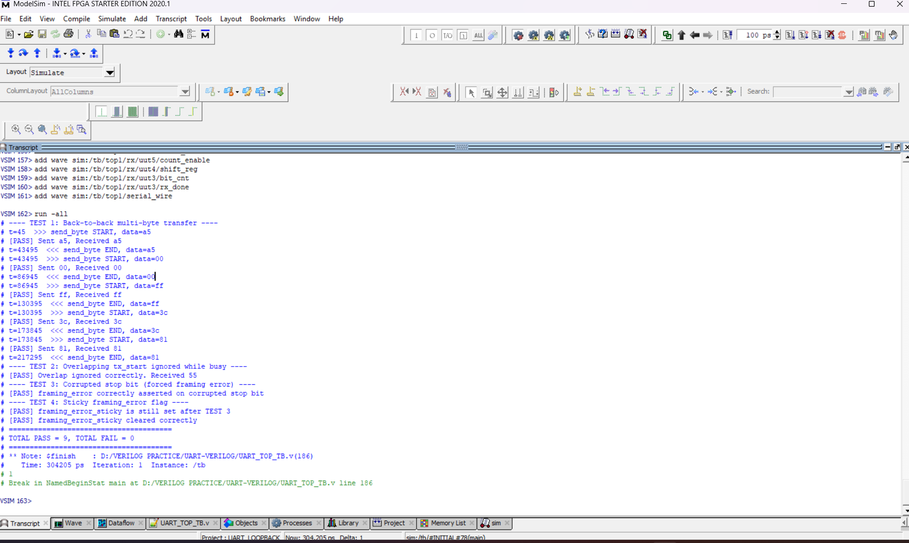

# UART Transmitter & Receiver — Verilog

A parameterized, fully synchronous UART (Universal Asynchronous Receiver/Transmitter) implemented in Verilog, with a self-checking testbench covering normal operation, busy-state protection, and framing-error detection.

**Author:** Tejo Rama Krishna

---

## Overview

This project implements a complete UART TX/RX pair as separate FSM-driven modules, wired together through a shared serial line (`UART_TOP`). It was built and debugged from scratch — including tracking down a real bit-width truncation bug during simulation — and verified against a directed testbench in ModelSim (Intel FPGA Edition, 2020).

**Frame format:** 1 start bit (`0`) + 8 data bits (LSB first) + 1 stop bit (`1`) — no parity.

```
Idle -- Start -- D0 -- D1 -- D2 -- D3 -- D4 -- D5 -- D6 -- D7 -- Stop -- Idle
  1  --   0   --  .............................................. --  1  --  1
```

---

## Block Diagram

```
                         ┌─────────────────────────┐
   tx_start, tx_data ──▶ │        top (TX)         │
                         │  fsm ── bit_counter      │
                         │   │        │             │
                         │  shift_register ◀── baudgenerator
                         └────────────┬────────────┘
                                      │ serial_wire
                                      ▼
                         ┌─────────────────────────┐
                         │       top_rx (RX)        │
                         │  start_bit ── fsm_rx      │
                         │      │           │        │
                         │  rx_timer ── bit_counter_rx│
                         │      │                     │
                         │  shift_register_rx          │
                         └────────────┬────────────┘
                                      ▼
                    rx_data, rx_done, framing_error,
                        framing_error_sticky
```

*(See `docs/block_diagram.png` for the hand-drawn version.)*

---

## Repository Structure

```
UART-VERILOG/
├── rtl/
│   ├── baudgenerator.v
│   ├── bit_counter.v
│   ├── fsm.v
│   ├── shift_register.v
│   ├── top.v
│   ├── bit_counter_rx.v
│   ├── start_bit.v
│   ├── fsm_rx.v
│   ├── rx_timer.v
│   ├── shift_register_rx.v
│   ├── top_rx.v
│   └── UART_TOP.v
├── tb/
│   └── UART_TOP_TB.v
├── docs/
│   ├── waveform_full_transfer.png
│   ├── waveform_framing_error.png
│   └── block_diagram.png
├── README.md
├── LICENSE
└── .gitignore
```

---

## Modules

| Module | Description |
|---|---|
| `baudgenerator` | Generates a `baud_tick` pulse once per baud period. Parameterized by `CLK_FREQ` / `BAUD_RATE`. |
| `bit_counter` | Counts the 10 bits of a TX frame (start + 8 data + stop) and signals `tx_done`. |
| `fsm` | TX controller — `IDLE → LOAD → RUN → STOP`. Drives `load`, `shift`, `baud_enable`, `count_enable`, `tx_busy`. |
| `shift_register` | Holds and shifts out the 10-bit TX frame `{stop, data[7:0], start}`, LSB first. |
| `top` | TX top-level, wires the four modules above together. |
| `start_bit` | Detects the falling edge on `serial_in` that marks the start of an incoming frame. |
| `rx_timer` | Generates half-bit (mid-bit alignment) and full-bit sampling ticks for the receiver. |
| `bit_counter_rx` | Counts the 8 received data bits and signals `rx_done_int`. |
| `shift_register_rx` | Shifts in 8 data bits and latches the completed byte into `rx_data`. |
| `fsm_rx` | RX controller — `IDLE → CHECK → RUN → CHECK_STOP → DONE`, with an `F_ERROR` state for invalid stop bits. |
| `top_rx` | RX top-level. Also latches `framing_error` into a sticky `framing_error_sticky` flag, cleared via `clear_framing_error`. |
| `UART_TOP` | Connects `top` (TX) and `top_rx` (RX) via a shared `serial_wire`, using identical `CLK_FREQ`/`BAUD_RATE` parameters on both sides so they can never drift out of sync. |

---

## Parameters

Both `CLK_FREQ` and `BAUD_RATE` are set at the `UART_TOP` level and propagate down to every timing-dependent submodule:

```verilog
UART_TOP #(
    .CLK_FREQ(50_000_000),
    .BAUD_RATE(115200)
) top1 ( ... );
```

Counter widths are fixed at 9 bits (`reg [8:0]`), which supports divide values up to 511. For much lower baud rates relative to clock frequency, widen these registers manually in `baudgenerator.v` and `rx_timer.v`.

---

## Verification

The testbench (`tb/UART_TOP_TB.v`) is a **directed** (not randomized/exhaustive) self-checking testbench covering four scenarios:

1. **Back-to-back multi-byte transfer** — sends 5 different bytes (`A5, 00, FF, 3C, 81`) in sequence and checks each received byte matches.
2. **Overlapping `tx_start` while busy** — asserts a second `tx_start` mid-transmission and confirms the FSM correctly ignores it, delivering the original byte unaffected.
3. **Corrupted stop bit** — forces the serial line low during the stop-bit period and confirms `framing_error` correctly asserts.
4. **Sticky framing-error flag** — confirms `framing_error_sticky` latches after a framing error and only clears when `clear_framing_error` is pulsed.

A watchdog timer (`#500000`) guards against simulation hangs.

### Latest run result

```
---- TEST 1: Back-to-back multi-byte transfer ----
[PASS] Sent a5, Received a5
[PASS] Sent 00, Received 00
[PASS] Sent ff, Received ff
[PASS] Sent 3c, Received 3c
[PASS] Sent 81, Received 81
---- TEST 2: Overlapping tx_start ignored while busy ----
[PASS] Overlap ignored correctly. Received 55
---- TEST 3: Corrupted stop bit (forced framing error) ----
[PASS] framing_error correctly asserted on corrupted stop bit
---- TEST 4: Sticky framing_error flag ----
[PASS] framing_error_sticky is still set after TEST 3
[PASS] framing_error_sticky cleared correctly
=======================================
TOTAL PASS = 9, TOTAL FAIL = 0
=======================================
```

### Waveforms

**Full transfer (TX → RX, one byte):**


**Corrupted stop bit → framing error:**



### Simulation Transcript

The ModelSim transcript confirms that all directed verification tests passed with zero failures.




---

## How to Run

Simulated using **ModelSim Intel FPGA Edition (2020)**. From the ModelSim console, in the project directory:

```tcl
vlog rtl/*.v tb/UART_TOP_TB.v
vsim tb
add wave -r /*
run -all
```

Or via the ModelSim GUI: create a new project, add all files under `rtl/` and `tb/`, compile, load `tb`, and run.

---

## Known Limitations

- **Single clock domain only.** `serial_wire` connects TX directly to RX on the *same* clock in this testbench. There is no clock-domain-crossing (CDC) synchronizer on `serial_in` — connecting this to a truly asynchronous external UART source would need a 2-flop synchronizer added to `top_rx` first.
- **No parity bit.** Frame format is start + 8 data + stop only.
- **Directed testbench, not randomized/exhaustive.** The testbench covers the four scenarios above; it does not sweep every possible byte value or every possible timing corner case.
- **Single-byte-at-a-time interface.** No internal buffering/FIFO — `tx_start` must not be reasserted while `tx_busy` is high (verified to be safely ignored, but no queuing occurs).

---

